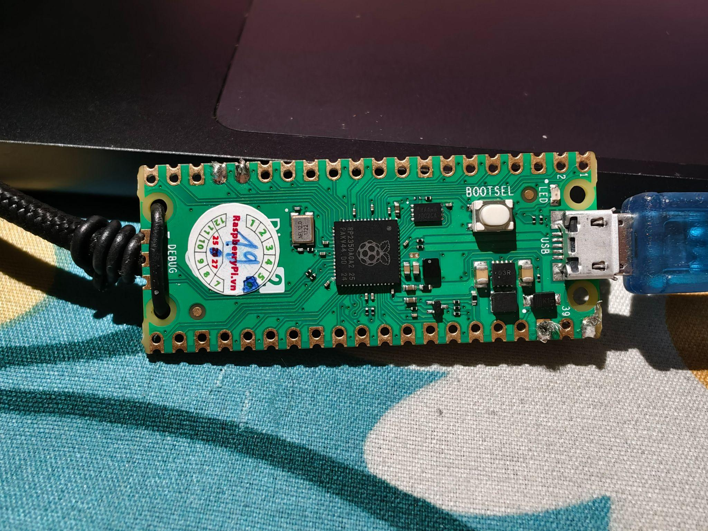
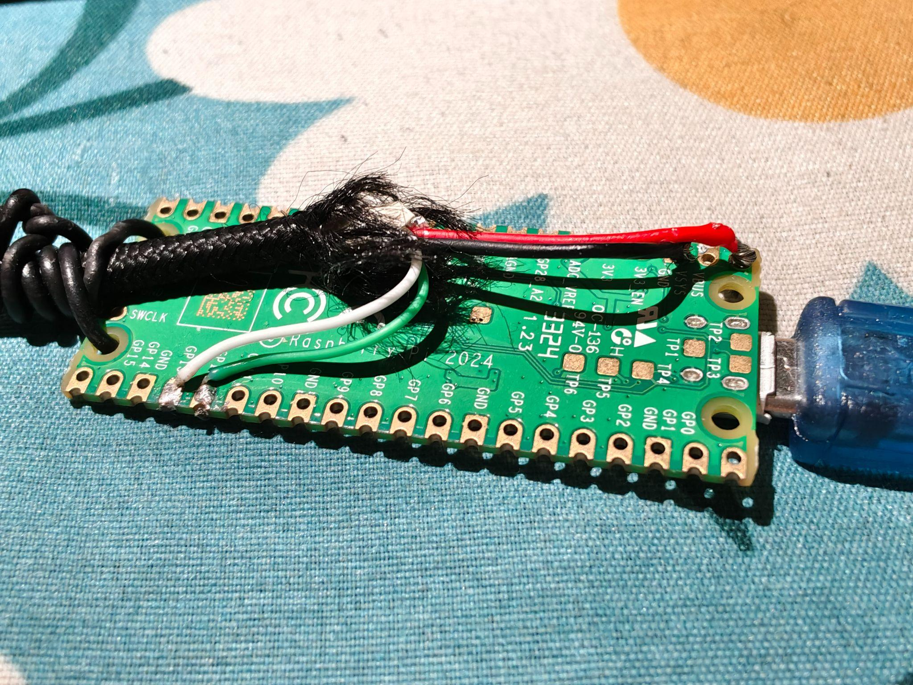
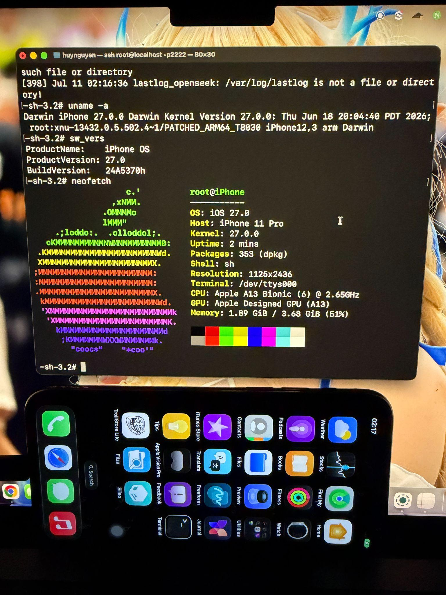

# iOS 27 jailbreak with usbliter8 exploit

> **CAUTION!**
>
> Running this (restoring a custom firmware) will delete your entire device and break everything: SEP, passcode, Wifi, Baseband, Bluetooth (partially work) and the entire Apple services, so please don't run it on your main device, ONLY do it on a spare **iPhone 11 Pro** only. This tutorial only targets developers that enjoy breaking their device!

Currently only **iPhone 11 Pro** is supported. Other devices require finding the correct offsets to make it work.

## Hardware setup

There's a SecureROM bug (released by Paradigm Shift) that requires the **RP2350** chip to exploit the device into PWN DFU mode. It only supports A12 and A13 (S4, S5 on Apple Watch series are also supported).

You need to drop the file from the original `usbliter8` source onto the board to make it run the exploit.

<p>
  
  
</p>

I use a **Raspberry Pi Pico 2** with RP2350 and a cut lightning cable:

- red → VBUS
- black → GND
- white (D-) → G13
- green (D+) → G12

## Downloads

- iOS 27.0 beta 2 for iPhone 11 Pro IPSW from [Apple's website](https://updates.cdn-apple.com/2026SpringSeed/fullrestores/140-20242/CD53E584-98E6-4560-B847-D8D5027223E8/iPhone12,3,iPhone12,5_27.0_24A5370h_Restore.ipsw).

Install requirements:

```shell
pip3 install requests pyimg4 pymobiledevice3
```

We work inside the `work-27.0b2` folder!

## Patches added

The original source from wh1te4ever included a lot of patches, you can read it in the code.

I added a few fixes to it to make it works:

| Component | Offset | Value | Notes |
| :---- | :---- | :---- | :---- |
| kernel `isDeviceInRestoreMode` | file `0x2894b68` (VA `0xFFFFFFF009898B68`) | `20 00 80 d2 c0 03 5f d6`| USB Restricted Mode bypass |
| kernel sandbox `file_check_mmap` | `0x2f774e0` | `00 00 80 d2 c0 03 5f d6` | Allow `/var/jb` execution (+ `mount_check_mount 0x2f75640`, `remount 0x2f75474`, `umount 0x2f75110`, `vnode_check_rename 0x2f7019c`) |
| kernel `AMFIIsCDHashInTrustCache` | `0x1f1ebe0` | `mov x0,#1;...` | Trust everything |
| DeviceTree `ephemeral-storage` | — | `u32=1` | Pass the 99% progress bar |
| `coreauthd` | `0x95c0` | `NOP` | Anti SEP crash |
| `ctkd` | `0x1b38/1b3c` | `mov x0,#0; ret` | Anti SEP crash |
| `mobileactivationd` `should_hactivate` | `0x2ebb14` | `20 00 80 52` (`mov w0,#1`) | Hacktivation |
| `mobileactivationd` `getActivationState` | `0x327cb0/d10/d14/d18` | `NOP/ADRP/ADD/NOP` → "Activated" | Belt-and-suspenders |

## Tutorial

Put the device in DFU mode, then plug it into the PWN DFU rig (the Raspberry Pi Pico 2 mentioned above).

> On the Pico 2, the light blinks twice while exploiting and stays lit on success. If the light turns off, the exploit failed, re-enter DFU mode and try again.

You can verify PWN mode by opening **System Configuration → USB tab → Apple Mobile Device (DFU Mode)**; if you see `PWND:[usbliter8]` then it worked.

### 1. Flash the Custom Firmware

After PWN DFU mode is done, plug the device back into the Mac, then:

```shell
cd work-27.0b2
./make_cfw.py            # requires sudo, enter your password
python3 tss_proxy_server.py && ./restore_cfw.sh
```

You'll see the restore progress bar on screen. Wait until the script is done and the device returns to recovery mode.

### 2. SSHRD boot

Re-enter DFU mode and PWN mode, plug it back into the Mac, then:

```shell
./get_rd.py
./boot_rd.sh
iproxy 2222 22 && ../tools/sshpass -p alpine ssh -o StrictHostKeyChecking=no -o UserKnownHostsFile=/dev/null -p 2222 root@localhost
```

On the SSH'd device, run:

```shell
/sbin/mount_apfs -o rdonly /dev/disk1s6 /mnt6
find /mnt6 -name sep-firmware.img4
```

`scp`/`cat` the file back to the Mac and name it `dev_sep.img4`. Back on the Mac:

```shell
../tools/img4tool -e -m t8030_apticket.der dev_sep.img4
```

The SSHRD log will print on screen, that means SSHRD succeeded.

### 3. Normal boot

```shell
./get_boot.py
./boot.py
```

That's the boot up. You can use SSH over dropbear and `iproxy` (default password `alpine`) to install Sileo with the bootstrap. Or you can do it over SSHRD.

### 4. Internet + bootstrap

Wifi and baseband are all broken, so if you need internet to install things:

```shell
./net_up.sh
```

This automatically shares your Mac's internet to the device over USB. After that, do the bootstrap and Sileo will show up.

If Sileo does not show up, re-enter SSHRD mode and move `/var/jb/Applications/Sileo.app` to the `/Applications/` folder in `mnt1` (or `mnt2` depending on your apfs mount). Once you boot back to normal, `uicache` the device to let Sileo appear. The hook already works for the entire system.

You also need to fix symlinks for the bootstrap, check `bootstrap_1900.tar.zst`.

If you only get 3 apps on screen (Settings, Phone and Feedback), move all staged apps to `/Applications/` in the system folder (in SSHRD):

```shell
for a in /mnt2/staged_system_apps/*.app; do
  b=${a##*/}; [ -e /mnt1/Applications/$b ] || cp -R "$a" /mnt1/Applications/
done
```

Enjoy!



## Credits

I need to acknowledge and credit some awesome projects that I based this work on.

- [**usbliter8-fun**](https://github.com/wh1te4ever/usbliter8-fun) by [**wh1te4ever**](https://github.com/wh1te4ever) for CFW and Ramdisk patched for iOS 27.0 beta 2 (24A5370h)
- [**khanhduytran0**](https://github.com/khanhduytran0) for idea on DeviceTree and USB Restriction in kernel
- **img4/img4tool** by [**tihmstar**](https://github.com/tihmstar) for sign IMG4 with APTicket
- **pyimg4/pymobiledevice3** by [**m1stadev**](https://github.com/m1stadev)/[**doronz88**](https://github.com/doronz88) for Export kernelcache, forward usbmux port
- **trollvnc** by [**Lakr233**](https://github.com/Lakr233) for Control device over USB
